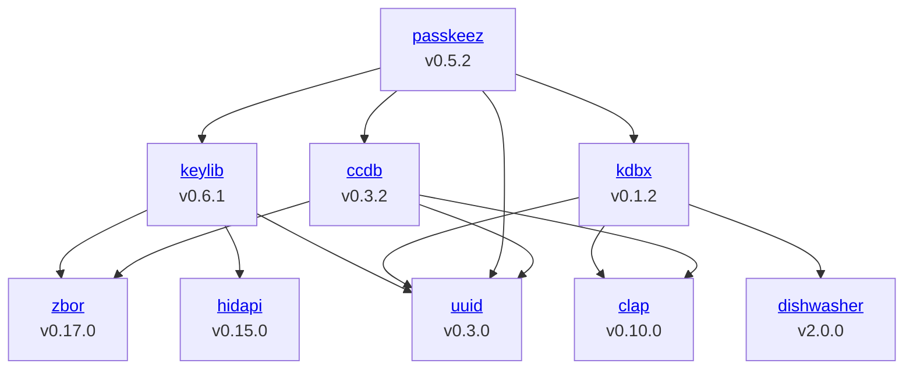

# Zig Audit Tool - ZAT

Required compiler version: 0.15.1

After compiling run _zat -h_.

> This is alpha software. Expect bugs and breaking changes!

## Features

### Dependency Graphs

Use ZAT to create dependency graphs.



The graph depicted above has been generated using `zat --graph --mermaid --path ~/passkeez-graph.txt`. Mermaid graphs can be added to a Github readme by putting it into a code block of the type `mermaid`.

### Software Bill of Materials (SBOMs)

User ZAT to create a SBOMs for your Zig packages.

Just run:
```bash
$ zat --sbom
```

To write the SBOM directly to a file use the `--path <PATH>` option.

#### Open Source SBOM tools

The following tools can be used to play with generated SBOMs:
- [sbom.sh](https://sbom.sh)

### Using the Github dependency submission API

Zat helps you with submitting dependencies for your projects on Github.

> Please note that publishing dependencies on Github isn't of much use yet
> as Github won't cross reference dependencies published via the API. That
> means for example that packages won't show up within the dependents list 
> of a repository.

#### Manual submission

Use the `--github-dependency` command to create a Json object that describes your packages dependencies. The command expects the following arguments:

- `sha`: The commit SHA associated with the dependency snapshot.
- `ref`: The repository branch that triggered this snapshot (_Please not that the dependency graph isn't updated if you don't specify the default branch, e.g. 'refs/heads/master'_).

```bash
zat --github-dependency \
    --correlator="zatworkflow" \
    --jobid="zatid" \
    --sha="203eef01dd9ea7f0602c79a0bd3edd60bb1a9e66" \
    --ref="refs/heads/master" \
    --minify
```

Furthermore, the following optional arguments can be used:

- `correlator`: A correlator used to group submitted snapshots, e.g. _GITHUB_WORKFLOW ++ GITHUB_JOB_.
- `minify`: Output minified Json.

The resulting Json object can then be submitted via the [REST API endpoint for dependency submission](https://docs.github.com/en/rest/dependency-graph/dependency-submission?apiVersion=2022-11-28). Below one can see a submission for the [Zig-Sec/kdbx](https://github.com/Zig-Sec/kdbx) repository:

```bash
curl -L \
  -X POST \
  -H "Accept: application/vnd.github+json" \
  -H "Authorization: Bearer <TOKEN>" \
  -H "X-GitHub-Api-Version: 2022-11-28" \
  https://api.github.com/repos/Zig-Sec/kdbx/dependency-graph/snapshots \
  -d '{"version":0,"job":{"id":"zatid","correlator":"zatworkflow"},"sha":"9942e370d962a418d2ee26ef34197042b53483b9","ref":"refs/heads/master","detector":{"name":"zat","version":"0.1.0","url":"https://github.com/Zig-Sec/zat"},"manifests":{"build.zig.zon":{"name":"build.zig.zon","file":{"source_location":"build.zig.zon"},"resolved":{"clap":{"package_url":"pkg:github/Hejsil/zig-clap@0.10.0"},"dishwasher":{"package_url":"pkg:github/edqx/dishwasher@2.0.0"},"uuid":{"package_url":"pkg:github/r4gus/uuid-zig@0.3.0"}}}},"scanned":"2025-09-14T17:26:35"}'
```

One can create a bearer token on Github under `Settings > Developer settings > Personal access tokens`. Make sure you select the `repo` scope. Also, make sure you enable the dependency graph for your repository under `Insights > Dependency graph`.

The Github API should respond with something like:

```bash
{
  "id": 34223554,
  "created_at": "2025-09-14T17:27:46.352Z",
  "result": "SUCCESS",
  "message": "Dependency results for the repo have been successfully updated."
}
```

#### Github Action

Coming soon...

## Sources of Information

Information about a package are gathered from the following sources:

- `build.zig.zon`: Package properties, including the version and package dependencies.
- `build.zig`: Modules, libraries, executables and other resources.

## Thanks

Special thanks to the following authors:
- Hejsil for [clap](https://github.com/Hejsil/zig-clap)
- nektro for [zig-time](https://github.com/nektro/zig-time)    
