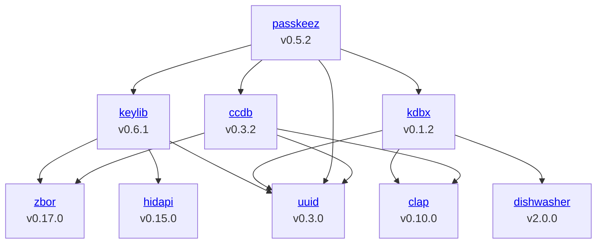

# Zig Audit Tool - ZAT

**ZAT is part of my master thesis with the title: Cyber risk reduction through transparency for Zig packages**

Required compiler version: 0.14.0

After compiling run _zat -h_.

> This is alpha software. Expect bugs and breaking changes!

## Features

### Auditing Zig Packages

Use ZAT to to audit a Zig package.

```bash
$ zat --audit
Scanning build.zig.zon for vulnerabilities (8 package dependencies)

Package:      zbor
Version:      0.17.0
Title:        This is the first advisory published to zig-sec/advisory-db.
Date:         2025-03-16
ID:           ZIGSEC-2025-0001
URL:          https://zigsec.org/advisories/ZIGSEC-2025-0001/
Solution:     Don't worry! But you should upgrade anyway as a new zbor release is available.
Dependency tree:
keylib 0.6.1
  └──zbor 0.17.0

error: 1 vulnerability found!
```

The example above is an audit of the [PassKeeZ](https://github.com/Zig-Sec/PassKeeZ) application.

The `--audit` command tries to find published vulnerabilities for every (transitive) dependency of a package.
Currently, ZAT only sources the [Zig-Sec Advisory Database](https://zigsec.org/). 

### Dependency Graphs

Use ZAT to create dependency graphs.



The graph depicted above has been generated using `zat --graph --mermaid --path ~/passkeez-graph.txt`. Mermaid graphs can be added to a Github readme by putting it into a code block of the type `mermaid`.

### Software Bill of Materials (SBOMs)

User ZAT to create a SBOMs for your Zig packages.

Just run:
```bash
$ zat --sbom
```

To write the SBOM directly to a file use the `--path <PATH>` option.

#### Open Source SBOM tools

The following tools can be used to play with generated SBOMs:
- [sbom.sh](https://sbom.sh)

### Sources of Information

Information about a package are gathered from the following sources:

- `build.zig.zon`: Package properties, including the version and package dependencies.
- `.git/config`: The url of the audited package.

## Thanks

Special thanks to the following authors:
- Hejsil for [clap](https://github.com/Hejsil/zig-clap)
- nektro for [zig-time](https://github.com/nektro/zig-time)    
- ziglibs for [ini](https://github.com/ziglibs/ini)
